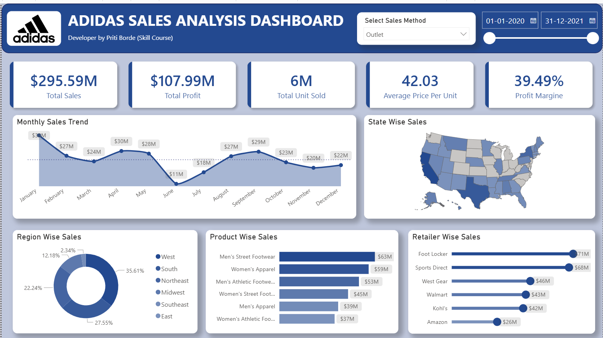

# 👟 Adidas Sales Analysis Dashboard | Power BI

## Dashboard Preview

---

## Project Overview

This project presents an interactive Adidas Sales Analysis Dashboard developed using Power BI, Power Query, DAX, and Data Modeling techniques.

The dashboard provides a comprehensive analysis of Adidas sales performance across different states, regions, retailers, and product categories. It enables stakeholders to monitor revenue, profitability, sales trends, and key business metrics through dynamic filters and visualizations.

---

## Business Objective

- Analyze overall sales performance.
- Monitor profitability and business growth.
- Identify top-performing products and retailers.
- Compare regional and state-wise sales.
- Discover sales trends over time.
- Support data-driven decision-making.

---

## Tools & Technologies Used

- Power BI
- Power Query
- DAX
- Excel
- Data Modeling
- Data Visualization
- Interactive Slicers
- KPI Cards

---

## Dataset Information

The dataset contains Adidas sales transaction data including:

- Invoice Date
- Region
- State
- Retailer
- Product Category
- Units Sold
- Price Per Unit
- Total Sales
- Operating Profit
- Operating Margin
- Sales Method

---

## Data Preparation

Data cleaning and transformation were performed using Power Query.

### Steps Performed

1. Imported raw sales dataset.
2. Removed duplicate records.
3. Handled missing values.
4. Corrected data types.
5. Standardized column names.
6. Created calculated measures.
7. Built data model relationships.
8. Developed KPI calculations using DAX.
9. Designed an interactive dashboard in Power BI.

---

## Dashboard Features

### KPI Cards

- Total Sales: $295.59M
- Total Profit: $107.99M
- Total Units Sold: 6M
- Average Price Per Unit: 42.03
- Profit Margin: 39.49%

### Monthly Sales Trend

- Tracks monthly sales performance.
- Identifies seasonal trends and fluctuations.
- Supports business planning and forecasting.

### State Wise Sales Analysis

- Interactive map visualization.
- Highlights sales distribution across states.
- Identifies high-performing markets.

### Region Wise Sales Analysis

- Compares sales contribution by region.
- Helps understand geographic performance.

### Product Wise Sales Analysis

- Evaluates performance of product categories.
- Identifies top revenue-generating products.

### Retailer Wise Sales Analysis

- Analyzes retailer contribution to total sales.
- Highlights top-performing retail partners.

---

## Key Business Insights

- Total Sales exceeded $295 Million.
- Total Profit reached approximately $108 Million.
- Profit Margin remained strong at 39.49%.
- West Region contributed the highest sales.
- Men's Street Footwear generated the highest revenue.
- Foot Locker emerged as the top-performing retailer.
- January recorded the highest monthly sales.
- June recorded the lowest monthly sales.

---

## Project Outcome

This dashboard helps stakeholders monitor sales performance, evaluate profitability, identify top-performing products and retailers, and make informed business decisions through interactive data visualization.

---

## Repository Structure

ADIDAS-SALES-ANALYSIS-DASHBOARD

- ADIDAS SALES ANALYSIS DASHBOARD.pbix
- Adidas US Sales_Datasets.xlsx
- DASHBOARD.png
- README.md

---

## Author

### Priti Borde

